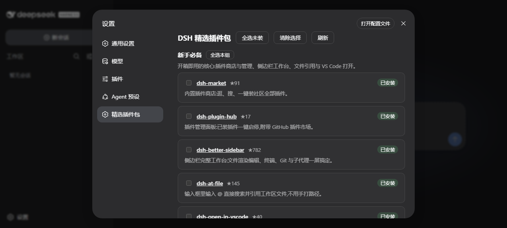

# dsh-starter-pack · DSH 精选插件包

为 [DeepSeek Harness](https://github.com/deepseek-ai/deepseek-harness)(`dsh`) 打造的一键精选插件包。装这一个插件,就能批量安装并配置一批最值得装的社区插件。

> English version: [README.md](README.md)。

## 为什么

DSH 社区已有 400+ 插件,新用户面对海量选择不知装什么。`dsh-starter-pack` 就是"开箱即用包":一份经过筛选、分好类的精选清单,一键装好。

## 安装

包已发布到 npm,直接安装即可(走 npm 预构建产物,免 pnpm 构建授权):

```sh
dsh plugin --profile web add dsh-starter-pack
```

GitHub 源码安装(可选):

```sh
dsh plugin --profile web add github:Dariandai/dsh-starter-pack
```

重启 `dsh web`,打开 **设置 → Starter Pack**,或在对话里用 `/setup`。

## 使用

**设置 → Starter Pack** —— 勾选分组,点"一键安装所选":



**斜杠命令** —— 无需打开 UI:

```text
/setup                    # 列出分组与各插件安装状态
/setup essentials         # 安装某一组
/setup external efficiency  # 安装多个组
/setup all                # 全部安装
```

已安装的插件会显示"已安装"徽章,重复执行自动跳过。新插件在重启 `dsh web` 后生效。

## 精选分组

- **新手必备** —— 插件商店与管理、侧边栏工作台、`@file` 引用、VS Code 打开、安全沙箱(mirage)。
- **外部能力** —— 视觉(modlens ★1.4k)、联网搜索(modsearch)、MCP 全家桶、上下文洞察面板。
- **记忆与技能** —— 跨会话持久记忆(dsh-mnemon)与 Skill 管理器。
- **效率与外观** —— 多供应商花费钱包、回合完成通知、换肤。

每个条目都注明推荐理由,并链接到对应仓库。清单按必要性、实用性、权威性筛选——无法可靠安装的插件(如 dsh-toolkit,其依赖 `@deepseek-ai/dsh-type-meta` 在 npm 缺失,官方讨论 #984)会被剔除。

## 工作原理

- 插件内置精选清单(`src/registry.ts`)。安装时逐个执行 `dsh plugin --profile <profile> add <target>`——有 npm 预构建包用 npm,否则用 `github:owner/repo`;已装自动跳过。
- **构建脚本**:git 安装的插件常带 `prepare` 步骤,pnpm 默认拦截。本插件把自身当作信任声明:首次遇到构建拦截时,在 profile 的 `pnpm-workspace.yaml` 写入 `allowBuilds`(含 `'*': true` 兜底)并重试。之后可自行编辑该文件恢复 pnpm 默认。
- **推荐配置**:对暴露了已验证 host 配置键的插件,向其 profile 的 `cordis.patch.yml` 写入 patch(仅合并、幂等)。多数精选插件默认值即推荐值。
- 安装通过 `child_process` 重放当前运行的 `dsh` 命令完成,与 `dsh-market` 的安装方式一致。

## 开发

```sh
pnpm install
pnpm run check      # 类型检查(host + client)+ 构建
npm pack            # 产出可发布的 tar 包
```

client 端用 `tsdown` 构建,并按 harness 的 `__ModuleLoader__` 契约打包(`scripts/normalize-client-banner.mjs`,由 `scripts/preflight.mjs` 校验)。

## License

MIT
